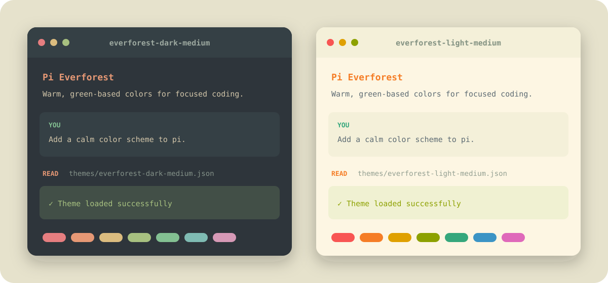

# Pi Everforest

[](https://www.npmjs.com/package/pi-everforest)
[](https://pi.dev/packages/pi-everforest)
[](./LICENSE)

Six warm, green-based [Everforest](https://github.com/sainnhe/everforest) color schemes packaged as installable themes for the [Pi coding agent](https://pi.dev).

<p align="center">
  
</p>

> The preview illustrates the package palettes. Exact colors depend on your terminal and display settings.

## Features

- Dark and light variants with hard, medium, and soft contrast levels
- Colors for Pi's UI, Markdown, diffs, syntax highlighting, thinking levels, and bash mode
- Matching colors for Pi HTML exports
- Native Pi package discovery through `pi.themes`
- No runtime dependencies

## Install

Install the package from npm:

```bash
pi install npm:pi-everforest
```

Or install it directly from GitHub:

```bash
pi install git:github.com/angribot/pi-everforest
```

To install the package only for the current project, add `-l`:

```bash
pi install -l npm:pi-everforest
```

## Themes

| Theme | Variant | Contrast |
| --- | --- | --- |
| `everforest-dark-hard` | Dark | Hard |
| `everforest-dark-medium` | Dark | Medium |
| `everforest-dark-soft` | Dark | Soft |
| `everforest-light-hard` | Light | Hard |
| `everforest-light-medium` | Light | Medium |
| `everforest-light-soft` | Light | Soft |

`medium` is Everforest's default contrast level and a good place to start.

## Use

### Select interactively

Open `/settings` in Pi and select one of the six theme names above.

### Configure a theme

Set the `theme` key in `~/.pi/agent/settings.json`:

```json
{
  "theme": "everforest-dark-medium"
}
```

### Follow terminal appearance

Pair a light theme with a dark theme to follow your terminal's appearance:

```json
{
  "theme": "everforest-light-medium/everforest-dark-medium"
}
```

The light theme goes before the slash and the dark theme after it. The same pattern works with the hard and soft pairs.

### Use for one session

Start Pi with a theme without changing the saved setting:

```bash
pi --use-theme everforest-dark-medium
```

Or use the automatic light/dark pair:

```bash
pi --use-theme everforest-light-medium/everforest-dark-medium
```

## Palette design

[Everforest](https://github.com/sainnhe/everforest) describes its palette as green-based, warm-toned, and designed around soft contrast. This package maps its two variants and three contrast levels onto Pi's theme tokens:

- core UI and message surfaces
- success, warning, and error states
- Markdown and code syntax
- tool output and diffs
- thinking-level and bash-mode borders
- HTML export surfaces

This is an independent Pi theme package based on the upstream Everforest palette; it is not an official Everforest project.

## Terminal notes

Pi uses 24-bit RGB colors. Most modern terminals support them, while older 256-color terminals receive an approximation.

You can check for true-color support with:

```bash
echo "$COLORTERM"
```

The result is commonly `truecolor` or `24bit`. In VS Code, set `terminal.integrated.minimumContrastRatio` to `1` if its automatic contrast adjustment changes the palette.

## Development

Load a theme directly from a checkout:

```bash
pi \
  --theme ./themes/everforest-dark-medium.json \
  --use-theme everforest-dark-medium
```

Validate all theme files as JSON:

```bash
for theme in themes/*.json; do
  python3 -m json.tool "$theme" >/dev/null || exit 1
done
```

Theme files include Pi's JSON schema URL for editor completion and validation.

## Credits

- Palette: [sainnhe/everforest](https://github.com/sainnhe/everforest)
- Pi theme documentation: [Themes](https://github.com/earendil-works/pi/blob/main/packages/coding-agent/docs/themes.md)
- Pi package documentation: [Packages](https://github.com/earendil-works/pi/blob/main/packages/coding-agent/docs/packages.md)

## License

[MIT](LICENSE). Everforest is also distributed under the MIT License by its upstream authors.
